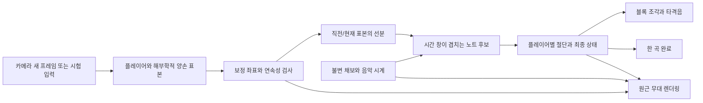

# 비전 세이버 진행표와 전환 설계

기준: 2026-09-27 KST, 시작 HEAD `fdbd8b4`. 사용자 제공 문서는 저장소의 SABER_PROMPTS.md와 제목의 Markdown 표시를 제외하고 내용이 같음을 확인했다. 이번 실행 범위는 첫 미완료 항목인 **0단계**다. 해당 단계의 게임 코드 변경 금지에 따라 설계·기준 검사·교차검토만 수행한다.

## 이번 실행의 사실과 한계

| 항목 | 직접 확인한 결과 |
|---|---|
| 작업 폴더 | `D:\3_GosranAI\8.visiongame\eolmaru-vision-game` |
| 시작 상태 | `git status --short` 출력 없음. 사용자 미커밋 변경 없음 |
| 실행 경로 | Start-Eolmaru.cmd → tools/launch.ps1 → tools/server.mjs, localhost:8765. 실제 HTTP 200 확인 |
| 기준 자동 검사 | `npm test`: **41 통과, 실패 0, 건너뜀 0**. 이번 0단계에서 재실행 |
| 기준 자산 감사 | `npm run audit:project`: **56개 / 33,573,975 bytes**, 누락·해시 중복·음성 오류·외부 URL 참조 모두 0 |
| 감사 시각 | ASSET_AUDIT.json의 2026-09-27 15:27:50 KST. 실행 도구가 checkedAt만 갱신함 |
| 소스 읽기 | app/core/show/show-render/fullscreen, 서버·실행기, 기존 관련 검사, AGENTS/README/PLAN/REVIEW/HANDOFF/TEST_RESULTS/ISSUES/SABER_PROMPTS |
| 이번에 수행하지 않은 것 | 브라우저 31개 검사 재실행, 실제 전체 화면 재측정, 웹캠 활성화, 사람 1~2인 플레이, 소리 청취, 하드웨어 재측정 |
| 코드 상태 | 게임은 여전히 **0.3 마루 리듬쇼**다. 세이버/블록 절단/새 채보가 구현됐다고 표시하지 않음 |

HTTP 응답은 서버가 페이지를 제공한다는 증거다. 화면·음악·카메라 동작 검증을 대체하지 않는다. 정적 외부 URL 검사 역시 실제 인터넷 차단 실행 시험과 구별한다. 이전 0.3의 브라우저·실기 대기 기록은 TEST_RESULTS.md를 따른다.

Canvas 원근 표현과 기존 Pose 손목 사용은 현재 구조를 활용하는 설계 선택이다. 실제 베기 인식 정확도와 렌더링 성능의 적합성은 후속 단계에서 측정해야 한다.

## 단계별 진행과 수락 조건

- [x] 0. 현행 확인·전환 설계·기준 검사·독립 검토·기획 대조
- [ ] 1. 원근 무대·양손 세이버·테스트 입력
- [ ] 2. 음악 시계·JSON 채보·4×3 접근 블록
- [ ] 3. 손·방향·교차 시각·궤적 절단 판정
- [ ] 4. 카메라 양손과 개인별 보정
- [ ] 5. 1인 한 곡 MVP·전체 화면·정지/재개
- [ ] 6. 한 카메라 최대 2인 독립 판정
- [ ] 7. 창작 연출·효과·음악·음성 다듬기
- [ ] 8. 채보 편집기 — MVP 이후 선택 확장
- [ ] 9. 최적화·오프라인 검증·정리·인수인계

| 단계 | 완료 증거로 남길 것 |
|---|---|
| 0 | 이 설계, 이번 기준 검사, SABER_REVIEW의 독립 대조. 앱 코드 변경 없음 |
| 1 | 두 손 선택/연속 이동/유한 궤적, 폼 입력 방해 없음, 원근 무대와 하단 카메라 유지, 작은 창/전체 화면 좌표 확인 |
| 2 | 실제 한 곡 채보, JSON 거절·원자적 적용, 오디오 시각에 따른 접근, 정지/탐색 후 활성 노트 복원 |
| 3 | 정상·틀린 손/방향·관통·늦은 표본·중복·가림·유예 확정 검사 |
| 4 | 새 카메라 프레임만 입력, 미러/손 구분/도달 범위, 8/12/20Hz와 누락 표본, 실제 사람은 별도 결과 |
| 5 | 120~180초 한 곡 흐름·무탈락·재시작·오디오 실패·실제 전체 화면. 전신 225초 회귀 |
| 6 | 같은 note.id를 각자 처리, 네 손 분리, 이탈/경계/충돌/자리 재배정, 합성과 실제 2인 결과 구분 |
| 7 | 잘 보이는 색+L/R+화살표, 제한된 효과·음원 수, 효과 전후 성능, 청취 별도 |
| 8 | 편집→JSON 저장→재입력의 동일 채보. 선택하지 않으면 보류 |
| 9 | 필요한 회귀·새 외부 차단 실행·파일 감사·실측·문서·허용된 게시 확인 |

필수 경로는 0~7→9다. 단계 5의 1인 MVP를 2인 완료로 표시하지 않는다. 0단계 체크는 아래 독립/기획 검토 결과를 반영한 완료 상태다. 초기 프롬프트의 체크는 이력 보존을 위해 고치지 않는다.

## 보존할 제품 범위

손 리듬은 의자에 앉아서 양손으로 한 곡, 1인 기본·최대 2인이다. 별도 전신 스트레칭은 서기 기본/누워서/커플, 3곡 앞 75초씩 총 225초를 유지한다. 누운 동작과 목·하체는 안내이며 관측하지 않은 수행 점수를 만들지 않는다.

왼쪽 조작, 위 게임/아래 카메라, 실제 전체 화면과 Esc 일시정지, 무료 로컬 실행을 유지한다. HP·탈락·보상·랭킹·계정은 넣지 않는다. Unity/VR/진짜 메시 절단/손가락 모델/온라인 협동은 보류다. 원본 음악·음성 제작소나 다른 사용자 프로젝트는 수정하지 않는다.

## 재사용·대체 경계

| 현행 구현 | 판단 | 전환 때 할 일 |
|---|---|---|
| app의 로컬 모델/카메라 시작·종료·GPU→CPU·인원 설정 | 재사용 | 새 프레임의 양손 표본 어댑터만 연결, 기존 카메라 권한 흐름 유지 |
| core의 mirrorPose | 재사용 | x 반전 한 번, 손목 인덱스와 해부학적 손 ID 보존 |
| core의 assignPlayers | 참고/제한적 재사용 | 현재는 같은 구역 둘 중 중심 가까운 한 명을 선택함. 세이버의 충돌 비움·재배정 epoch는 새 어댑터에서 처리 |
| core의 GestureTracker | 세이버에서 대체 | 방향 배열과 Set으로 손/위치/개별 시각을 잃으므로 연속 궤적 판정에 사용 불가 |
| core의 judgeHit/expireNotes/createScore | 세이버에서 대체 | 방향·현재 시각의 즉시 명중/만료를 새 교차 시각·유예·관측 상태로 변경. 기존 전신/검사 사용 여부 확인 전 삭제 금지 |
| show의 generateShowChart/makeCueEvents | 새 채보와 어댑터로 대체 | 기존 demoTime/lane과 새 hand/4×3는 호환되지 않음. 8박 시범/응답 강제 제거 |
| show의 RhythmAudio/CueCursor | 자원 관리·합성음 원리 재사용 | 새 채보를 setChart에 그대로 전달하지 않음. hit 이벤트는 판정 결과로만 생성, 기존 demoTime 큐를 새 입력에 억지로 만들지 않음 |
| show-render의 drawRhythmShow | 세이버 렌더로 대체 예정 | 기존 call-response 그림에서 원근 블록/세이버로 변경 |
| show-render의 drawWelcome/drawStretchWorld/drawWorld | 보존 | 같은 파일에 전신 렌더가 있고 show의 ACTS를 사용함. show/show-render 통째 삭제 금지 |
| fullscreen의 FullscreenController | 그대로 재사용 | 취소/늦은 응답/exit 경합 처리를 보존하고 세이버 초기화를 앱 수명주기에 연결 |
| app의 gameGeneration·pause/resume/reset·로컬 파일 선택 | 재사용하며 연결 변경 | 새 입력 epoch·판정·효과 자원도 취소. 시간 보정의 의미와 JSON 원자적 적용 추가 |
| routine/routine-profiles/figures·전신 집계 | 보존 | 새 리듬 판정과 분리, 각 프로필과 무채점 회귀 유지 |
| public의 레이아웃/설정/카메라·음원/음성·모델 | 재사용 | 왼쪽 시험 입력 안내와 새 보정 항목만 필요한 단계에서 추가 |

근거 함수와 검사 위치는 SABER_REVIEW.md에 기록한다. 보존은 영구적으로 오래된 코드를 모두 남긴다는 뜻이 아니다. 새 기본 경로가 검증된 뒤 참조와 검사 사용처를 확인해 단계 9에서 미사용 부분만 정리한다.

## 데이터 흐름과 파일 책임

| 예정 파일 | 책임 / 시작 단계 |
|---|---|
| src/saber-input.mjs | 표본 타입, 시험 조작, 미러/보정 변환, 연속성·stroke/epoch 관리. 1에서 시험 입력, 4에서 카메라, 6에서 충돌/좌석 처리 |
| src/saber-render.mjs | 4×3 정사각 셀 판정면과 원근 투영, 세이버/유한 궤적, 노트·효과. 1에서 무대, 2에서 접근 노트, 7에서 연출 |
| src/saber-chart.mjs | v1 검증/정규화/쉬운 채보, 시간 공식, 활성 노트 범위. 단계 2 |
| src/saber-core.mjs | 순수 선분 교차·방향/손/시각·최종 상태·관측 가용성, 플레이어별 상태. 단계 3 |
| src/app.mjs | 실제 DOM 이벤트·모드별 실행기·음악/전체 화면·카메라 연결. 단계 1부터 필요한 연결만 |
| public/charts/maru-flow.saber.json | 기존 150초 음악용 실제 v1 채보. 단계 2, 원본 음원 변경 없음 |
| tests/review-saber-*.test.mjs | 순수 입력/채보/판정의 의미 있는 경계 검사. 필요한 단계에서 추가 |
| tests/browser-saber.js | 실제 입력/곡 종료/1~2인/전체 화면/모드 회귀의 브라우저 검사. 단계 1의 화면부터 점진 추가 |

이번 단계에서는 위 소스/검사/채보 파일을 만들지 않는다. 파일 이름은 설계안이며 구현 중 책임을 합칠 필요가 있으면 근거를 여기에 남긴다. 새 npm 패키지는 현재 필요하지 않다.

## 좌표와 입력 계약

1. **원본과 거울**: 원본 정규화 카메라 좌표는 `(xr,yr)`, 거울 좌표는 `(1-xr,yr)`이다. 15번 손목은 사람 자신의 왼손, 16번은 오른손으로 유지한다. 좌우가 교차해도 손 ID를 x 순서로 재분류하지 않는다.
2. **화면 좌석**: 1인은 P1. 2인은 거울 화면 어깨 중심 x<0.47=P1, x>0.53=P2, 가운데는 입력 없음. 이 값은 현행 기준을 시작값으로 보존한다. 한 구역에 유효 후보 둘이 들어오면 세이버에서는 해당 구역 전체를 비운다. 검출 결과 배열 순서·얼굴 신원에 의존하지 않는다.
3. **연속성**: 사람 소실/구역 충돌/재배정/좌표 보정/곡 변경/정지·재개 시 `inputEpoch`를 올리고 직전 표본·스트로크를 비운다. 구역으로만 사람을 나누므로 신원 보존을 보장하지 않는다. 소실/큰 몸통 점프 등의 보수적 검사를 통과한 새 연속 표본부터 사용한다.
4. **영상 여백**: 현재 하단 미리보기는 원본 비율을 유지해 가운데 맞춘다. videoWidth/Height와 scale/ox/oy를 사용한다. CSS 화면 픽셀을 원본 정규화 좌표로 착각하지 않는다. 미러 이미지를 그릴 때와 이미 미러된 관절을 그릴 때 반전을 추가하지 않는다.
5. **개인 범위**: 편안히 앉아 손이 닿는 범위를 플레이어별로 보정한다. x에는 영상 가로/세로 비율을 곱해 y와 같은 물리적 영상 단위를 만든다. 이 범위 안에 4:3 직사각형을 중앙 배치하고, x/y에 같은 배율로 4×3 판정 좌표로 변환한다. 두 축을 제각각 늘여 방향 각도가 왜곡되는 설계는 피한다. 세션 중 변환을 고정하고 재보정은 epoch를 바꾼다.
6. **판정면**: 플레이어별 x∈[0,4], y∈[0,3]. 열 0은 왼쪽, 층 0은 위, 목표 중심은 `(lineIndex+0.5,lineLayer+0.5)`다. 한 셀은 가로/세로 같은 단위다. 목표 사각형 시작안은 중심 기준 폭/높이 0.72셀이다. 최적값이라고 보장하지 않는다.
7. **렌더링**: 각 플레이어 화면 영역에 4:3 판정면을 비율 유지로 넣는다. 가까운 z=0에서 보이는 목표와 판정 사각형이 일치해야 한다. 먼 블록의 원근 그림·장식용 검 끝은 충돌 영역이 아니다. 좌석을 나누는 화면 변환과 해부학적 손 구분은 별개다.
8. **화면 변경**: 창 크기/전체 화면/DPR는 렌더 변환만 갱신한다. 카메라 보정 좌표는 CSS 크기에 의존하지 않는다. 포인터의 CSS→판정 변환이 바뀌면 이전 시험 입력 궤적을 비워 순간 점프를 방지한다.
9. **시험 입력**: 카메라 입력과 명시적으로 배타적이다. Q/E는 왼손/오른손, 1/2는 P1/P2 선택, 포인터 또는 방향키 연속 이동을 시작 키맵으로 한다. 실제 카메라 네 손 동시성은 합성 표본으로 별도 검사한다. 단일 포인터 조작을 실제 2인 증거로 쓰지 않는다.

예정 표본 필드: `sessionId, inputEpoch, source(camera/test), player(0/1), hand(left/right), x, y, capturedAtMs, audioTimeSeconds, confidence, frameId, valid`. 좌표·시각·신뢰도가 잘못되거나 epoch가 다르면 선분을 만들지 않는다. `strokeId`는 손별 연속성 상태에서 생성하고 유지한다. 관측 표본과 효과용 보간 좌표는 별도로 보관한다.

## 음악 시각과 판정 계약

- 원본 채보는 SABER_PROMPTS의 v1이다. bpm 40~240, time 초, offsetSeconds 유한수, 고유 id, 열 0~3/층 0~2 정수, hand와 5개 방향을 검증한다.
- 시간은 마이크로초 정수로 정규화해 동시 묶음을 판별한다. 묶음당 서로 다른 손·칸 최대 2개, 묶음 간 최소 2박, 반올림 오차 1마이크로초만 허용한다. 최대 1MB/2000개는 초기 정책이다.
- `hitAudioTime = note.time + chart.offsetSeconds`; `spawnAudioTime = hitAudioTime - leadSeconds`; `z = speed × (hitAudioTime - audio.currentTime)`. leadSeconds 초기값은 1.8초다. 프레임 적산으로 노트를 움직이지 않는다.
- raw time과 offset 적용 후 시각을 모두 검증한다. spawn<0은 거절, hit는 0~duration-1초다. 마지막 1초는 최종 판정/짧은 효과 여유다. 검증 실패 시 이전 곡과 세션을 보존한다.
- 새 프레임을 추론 캔버스에 복사하는 순간에 음악 시각과 단조 시각을 함께 읽어 앵커로 보관한다. 같은 실행 구간에서 `sampleAudioTime = anchorAudioTime + (captureMs-anchorMs)/1000 - inputLatencySeconds`로 맞춘다. playbackRate=1을 전제로 하며 정지·탐색·재개는 새 앵커/epoch다. 추론이 끝난 뒤의 음악 시각을 촬영 시각으로 사용하지 않는다.
- 위 capture는 센서 노출 시각이 아니라 브라우저에서 프레임을 읽은 시점이다. 카메라 파이프라인 지연은 실측 전에는 알 수 없다. inputLatencySeconds=+0.10은 관측 시각에서 0.10초를 뺀다. 효과가 빠르다고 센서 지연까지 측정했다고 말하지 않는다.
- **기존 settings.offset은 그대로 재사용하지 않는다.** 현재 app에서는 판정·그림·시범음에 함께 적용된다. 새 `chart.offsetSeconds`와 `inputLatencySeconds`를 분리해 중복 적용을 차단한다. 기존 설정을 가져오는 정책은 SB03에 기록하며 조용히 의미를 바꾸지 않는다.
- 유효한 두 표본 구간과 노트 창이 겹칠 때만 선분 교차를 검사한다. 실제 교차 비율의 보간 시각으로 판정한다. 방향 벡터는 up=(0,-1), down=(0,1), left=(-1,0), right=(1,0), any는 방향 조건만 생략한다.
- 초기 판정 창 ±0.25초/방향 오차 50도/최대 표본 간격 0.20초/입력 보정 절댓값 최대 0.25초/유예 0.45초는 설계 가설이다. 같은 epoch의 dt>0·dt≤0.20인 유효 표본만 연결한다. 큰 점프·떨림·정지 배제 임계치는 3~4단계에서 측정해 정한다.
- 각 손 스트로크당 한 블록, `(player,note.id)`당 한 최종 상태다. 후보 순서는 교차 시각→목표 시각→안정적인 id 순서로 고정하고 동일 노트 경합은 한 번만 확정한다.
- 창 끝+0.45초까지 유효 표본을 먼저 처리한 뒤 최종 미명중을 확정한다. 필요한 손의 연속 관측구간 합집합이 창의 80% 이상이면 miss, 부족하면 untracked다. 플레이어의 즉시 인식 상태와 노트의 최종 상태를 구별한다.
- 상태는 `pending → hit | wrongCut | miss | untracked`로 한 번만 바뀐다. 확정 후 도착한 표본은 되살리지 않는다. ±0.25+0.45=0.70초라 기본 설정에서는 곡 끝 1초 여유 안에 최종 확정된다. 설정 상한을 늘리면 끝 여백도 다시 검증한다.
- 게임 일시정지 동안 관측 커버리지/채보 시각을 진행시키지 않는다. 재개 첫 프레임은 선분을 만들지 않는다. 연습용 seek는 과거 결과를 소급 생성하지 않고 새 epoch/현재 활성 범위로 복원한다.

공유하는 것은 오디오와 검증된 불변 채보다. 양손 표본, epoch, 보정, stroke, 노트 상태, 관측 구간, 효과는 P1/P2 각각 소유한다. P1의 명중이 P2의 같은 노트를 제거할 수 없다.

## 1단계의 실제 변경 범위

| 파일 | 다음 단계에서 할 변경 |
|---|---|
| src/saber-input.mjs (신규) | 시험 입력 표본과 손/플레이어 선택, bounded trail, 원근과 무관한 판정 좌표 변환, reset |
| src/saber-render.mjs (신규) | 정사각 셀 4×3 무대·소실점·판정면·색+L/R 세이버·궤적. 블록 판정 없음 |
| src/app.mjs | 손 리듬 안에서 세이버 조작 연습을 선택·종료하는 시험 경로, 폼/버튼 초점 보호, epoch 초기화·렌더 연결 |
| public/index.html/style.css | 왼쪽의 손/플레이어 선택·시험 조작 안내. 위 무대/아래 카메라와 전신 선택 유지 |
| tests/review-saber-input.test.mjs (신규) | 좌표 변환/손 선택/리셋/시간/궤적 상한, resize 후 순간 점프 없음 |
| tests/browser-saber.js (신규) | 실제 포인터/키보드·폼 초점·화면 변경·연습 종료와 전신 복귀 |

1단계에서는 손 리듬 내부의 **세이버 조작 연습**으로 먼저 검증한다. 연습에는 음악 채보·절단 성공·점수 표시를 넣지 않는다. 같은 키가 기존 방향 hit 함수에도 전달되지 않게 입력 경로를 분리한다. 전신 모드는 이 연습 경로에 들어가지 않는다.

기존 한 곡 리듬쇼는 세이버 한 곡 흐름이 준비되는 5단계까지 보존한다. 2~4단계는 연습 경로에 접근 노트·판정·카메라를 순서대로 붙인다. 5단계에서 손 리듬 기본 실행을 세이버로 전환하고 임시 중복 진입점을 제거한다. 별도 세 번째 제품 카테고리를 영구 추가하는 설계는 아니다.

단계 1에서 기본곡/채보 로더/절단/카메라 보정/스트레칭 수학/FullscreenController를 새로 구현하거나 교체하지 않는다. 관련 순수 검사와 화면 검사를 실행하고 기존 `npm test`를 보존 확인으로 수행한다. 필요한 브라우저 회귀는 손 입력 초점·전체 화면 좌표·연습 종료/전신 복귀다.

## 최적화와 정리 결정

- 0단계 자산 감사에서 누락/동일 해시 중복이 없어 삭제한 파일은 없다. 소스 전체의 미사용 여부를 이 감사 하나로 증명한 것은 아니다.
- 새 라이브러리·모델·그림·음원·음성·설치기는 추가하지 않았다. 기존 56개 런타임 파일과 크기는 유지됐다.
- show/show-render는 전신의 shared dependency다. 이름만 보고 오래된 리듬 파일이라고 삭제하지 않는다.
- 모든 새 연출은 유한 trail/입자/동시 음원 수, 제한된 DPR을 전제로 한다. 프레임률 향상은 아직 측정 결과가 없으므로 주장하지 않는다.
- 진짜 VR 검 회전/손가락 추론/정밀 메시 절단/온라인 모드는 메뉴를 만들지 않고 보류한다. 선택 채보 편집기는 필수 완료를 막지 않는다.
- 사용자가 제공한 붙여넣기 원본을 저장소에 중복 복사하지 않았다. 초기 SABER_PROMPTS도 변경하지 않았다.

## 3개 역할과 결정 기록

| 역할 | 이번 수행 | 결과 |
|---|---|---|
| 생성엔진 | 현행 소스 확인, baseline 41개/자산 감사, 이 전환 설계 작성 | 설계·기준 검사 완료. 게임 코드 변경 없음 |
| 독립 검토엔진 | 기존 입력·좌석·시계·오디오·전체 화면 소스/검사와 최종 설계 대조 | 근거 행을 재확인하고 SABER_REVIEW 완료. 시간/좌표/단계 전환에 차단 모순 없음, 1단계 착수 가능 |
| 종합기획엔진 | 최신 사용자 프롬프트와 현행 문서/공유 렌더 경계 및 최종 진행표 대조 | 단계 0 완료 조건 충족. 최대 2인·별도 전신·무탈락·1단계 범위 유지 확인 |

최종 교차검토를 완료했고 전환 위험과 후속 구현은 SABER_REVIEW와 ISSUES의 SB 항목으로 연결했다. 문서 링크/코드 블록 짝/완료 체크도 확인했으며 git 비교로 src/public/tests/tools/패키지/실행 파일에 변경이 없고 자산 감사 내용도 checkedAt 외에는 같음을 확인했다. 이번 시작 시 사용자 결정이 필요한 사항은 없다. **다음 실행 단계는 1: 무대·양손 세이버·테스트 입력**이다. 카메라 절단과 실제 2인 체감 검증은 후속 단계의 미완료 항목이다.
